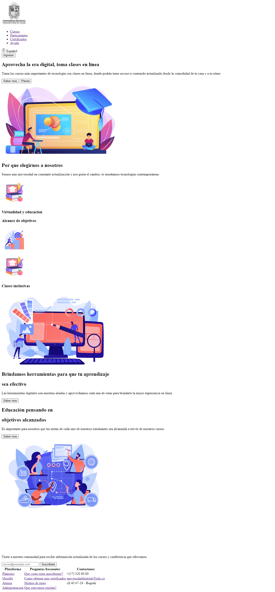
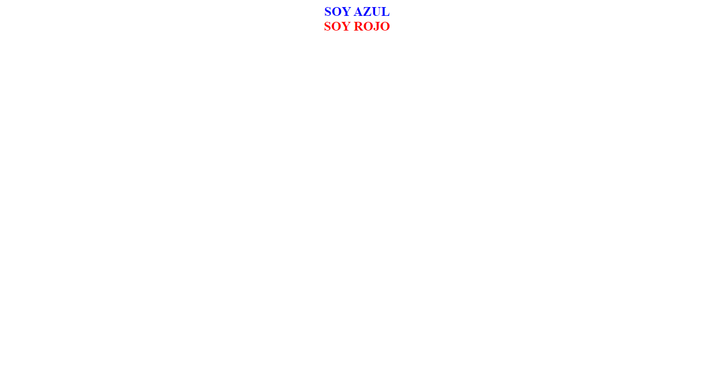
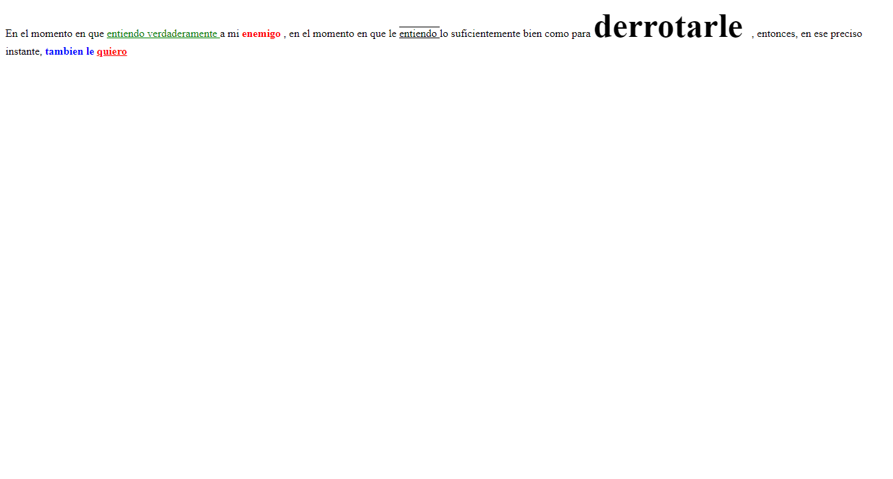

<h1>Cristian Fabian Quiroz Segura</h1>
<h2>Informacion: </h2>

 Curso : Fullstack basico - grupo 1

 Profesor : Cristian Patiño

<h2>Punto 1: link de Figma</h2>
<a href="https://www.figma.com/file/P0SGZCqK7Ky3XSwLaU39l4/Cristian-Quiroz-ejercicio-figma?type=design&node-id=0%3A1&t=Gbu5rVefeBw3pTal-1"> link de Figma</a>
<h2>Punto 2: HTML</h2>

<h2>Punto 3: CSS</h2>

<h2>Punto 4: Textos de colores</h2>

<h2>Punto 5: Textos de diferentes estilos</h2>

<h2>Punto 6: link and hover</h2>

<h2>Punto 7 y 8: </h2>

<h2>Punto 6: link and hover</h2>
